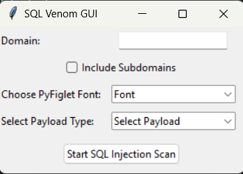

# SQL Venom

<u>
</u>

SQL Venom is a simple Python tool designed for scanning SQL injection vulnerabilities in a target domain. The tool utilizes various Python libraries and modules, including requests, argparse, and custom modules for making requests, extracting parameters, and crawling URLs. It also features colorful terminal output using huepy and ASCII art banners with pyfiglet.

 

## Key Features:
##### Domain Scanning: Specify the target domain, and SQL Venom will spider through the domain, extracting URLs for further analysis.

##### Payload Testing: The tool tests each URL with a set of SQL injection payloads to detect potential vulnerabilities.

##### Keyword Detection: SQL Venom looks for SQL-related keywords in the response content to identify potential injection points.

## How to Use:

#### Clone the repository:

* git clone https://github.com/SuvidhKant/SQLVenom.git

#### Navigate to the project directory:

* cd SQLVenom-Main

#### Install the required dependencies:

* pip install -r requirements.txt

#### Run SQL Venom with the target domain:

* python SQLVenom.py 

## Disclaimer:
This tool is intended for educational purposes and security assessments. Use it responsibly and only on systems where you have explicit permission to test.

## Note: The tool uses a basic keyword detection method and may produce false positives. Additional testing and validation are recommended.
