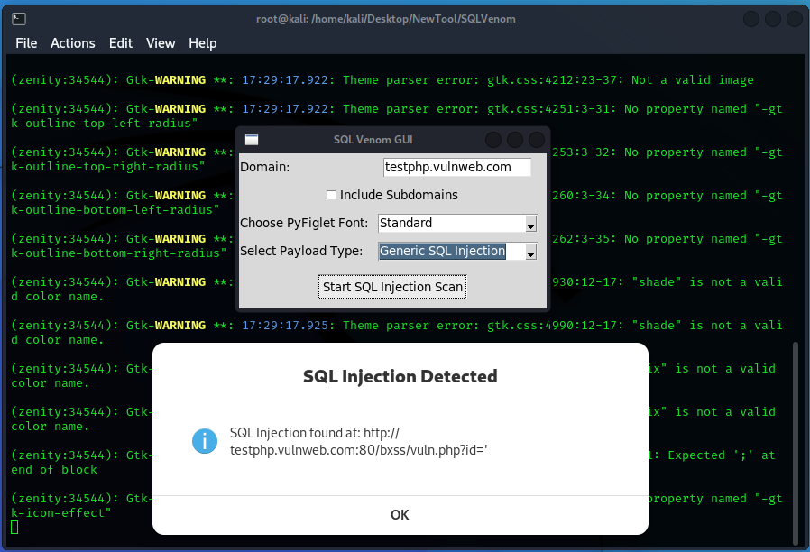

# SQL Venom

<u>
</u>

SQL Venom is a cutting-edge Python tool, expertly designed for scanning SQL injection vulnerabilities in target domains. Leveraging Python libraries like requests and argparse, it delivers swift and thorough assessments. Custom modules for request handling, parameter extraction, and URL crawling ensure a comprehensive analysis. The tool's vibrant terminal output, thanks to huepy, enhances user experience. ASCII art banners using pyfiglet add a visually appealing touch. Elevate your security assessment with SQL Venom - a powerful, user-friendly solution for robust SQL injection vulnerability detection.

 

## Key Features:
##### Domain Scanning: Specify the target domain, and SQL Venom will spider through the domain, extracting URLs for further analysis.

##### Payload Testing: The tool tests each URL with a set of SQL injection payloads to detect potential vulnerabilities.

##### Keyword Detection: SQL Venom looks for SQL-related keywords in the response content to identify potential injection points.

## How to Use:

#### Clone the repository:

* git clone https://github.com/SuvidhKant/SQLVenom.git

#### Navigate to the project directory:

* cd SQLVenom-Main

#### Install the required dependencies:

* pip install -r requirements.txt

#### Run SQL Venom with the target domain:

* python SQLVenom.py 

## Disclaimer:
This tool is intended for educational purposes and security assessments. Use it responsibly and only on systems where you have explicit permission to test.

## Note: The tool uses a basic keyword detection method and may produce false positives. Additional testing and validation are recommended.
